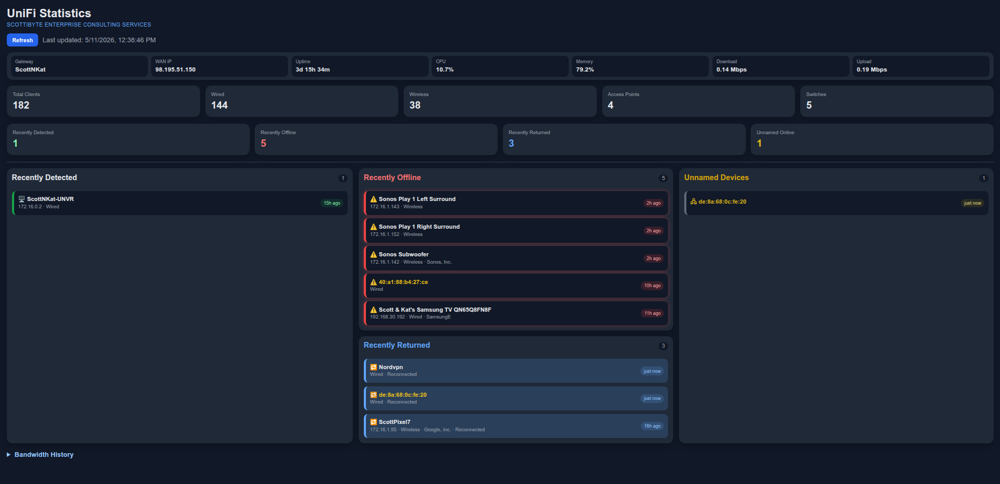

# UniFi Statistics

A modern real-time UniFi network awareness dashboard developed by ScottiBYTE.

UniFi Statistics provides enhanced visibility into network activity, client behavior, recently disconnected systems, unnamed devices, and historical bandwidth usage in a clean and lightweight web interface.

---

## Dashboard Overview



---

## Features

- Real-time UniFi client tracking
- Recently detected client visibility
- Recently offline client monitoring
- Recently returned client tracking
- Unnamed device identification
- Historical bandwidth usage graph
- Lightweight web-based dashboard
- Docker deployment support
- Persistent local data storage
- Read-only UniFi API interaction

---

## Quick Start

### Create `.env`

```env
UNIFI_URL=https://192.168.1.1
UNIFI_USERNAME=your_username
UNIFI_PASSWORD='your_password_here'
UNIFI_SITE=default
PORT=3050
```

> Passwords containing `$` symbols must be wrapped in quotes.

---

## docker-compose.yml

```yaml
services:
  unifi-statistics:
    image: scottibyte/unifi-statistics:v1.0
    container_name: unifi-statistics
    restart: unless-stopped

    ports:
      - "80:3050"

    env_file:
      - .env

    volumes:
      - ./data:/app/data
```

---

## Deploy

```bash
docker compose up -d
```

---

## Access the Dashboard

```text
http://SERVER-IP/
```

Example:

```text
http://192.168.1.50/
```

---

## Data Storage

Persistent application data is stored locally in:

```text
./data
```

No additional `config.json` file is required.

---

## Docker Tags

| Tag | Description |
|---|---|
| `latest` | Current production build |
| `v1.0` | Initial stable release |

---

## Docker Hub

https://hub.docker.com/r/scottibyte/unifi-statistics

---

## GitHub Repository

https://github.com/ScottiBYTE/unifi-statistics

---

## License

MIT License

---

## Author

Developed by ScottiBYTE  
https://www.scottibyte.com
